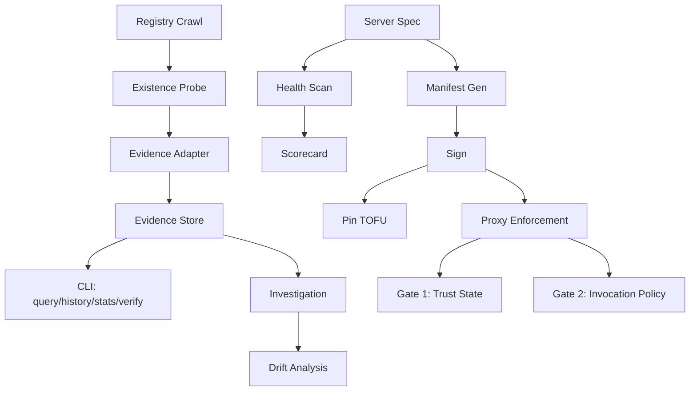

# Trustcard in Five Minutes

> Install, pin, scan one server, read evidence. No prior knowledge needed.

---

## 1. Install (30 seconds)

```bash
npm install -g mcp-trustcard
```

Verify:
```bash
mcp-trustcard --help
```

## 2. Scan a server (1 minute)

Scan any MCP server to get a health scorecard:

```bash
# Scan an npm package
mcp-trustcard scan @modelcontextprotocol/server-filesystem

# Scan a local command
mcp-trustcard scan -- npx -y @modelcontextprotocol/server-filesystem

# Scan a remote server
mcp-trustcard scan https://api.example.com/mcp
```

Output: a scorecard with handshake, tools, security checks, and a trust score.

## 3. Generate a manifest and pin (1 minute)

Create a cryptographic manifest that records the server's identity:

```bash
# Generate a publisher keypair
mcp-trustcard keygen --out my-key.json

# Create a manifest for a server
mcp-trustcard gen-manifest @modelcontextprotocol/server-filesystem --save-manifest server.json

# Sign it
mcp-trustcard sign server.json --key my-key.json --out server-signed.json

# Pin it (TOFU — trust on first use)
mcp-trustcard pin @modelcontextprotocol/server-filesystem

# List pins
mcp-trustcard pins
```

## 4. Run a proxy with enforcement (1 minute)

The proxy enforces the manifest — dangerous tools are stripped, calls are
validated against the signed capability descriptor:

```bash
# stdio server
mcp-trustcard manifest --manifest server-signed.json -- npx -y @modelcontextprotocol/server-filesystem

# HTTP server
mcp-http-proxy --manifest server-signed.json --upstream https://api.example.com/mcp --port 8080
```

## 5. Emit and query evidence (1 minute)

Run an ecosystem scan that stores evidence records:

```bash
# Scan 100 servers and store evidence
node scripts/scan-ecosystem.mjs --sample 100 --existence-only \
  --evidence-store data/evidence \
  --registry-file data/mcp-registry-2026-07-27.json

# Verify evidence integrity
mcp-trustcard evidence verify --evidence-dir data/evidence

# View stats
mcp-trustcard evidence stats --evidence-dir data/evidence

# Query a specific server's history
mcp-trustcard evidence history --subject io.github.brave/brave-search-mcp-server --evidence-dir data/evidence
```

---

## What you have now

- A **health scorecard** for any MCP server
- A **signed manifest** that cryptographically identifies a server's capabilities
- A **TOFU pin** that detects if the server changes
- An **enforcement proxy** that blocks dangerous tools and unauthorized calls
- An **evidence store** with verifiable observations about the MCP ecosystem

## Next steps

- `mcp-trustcard diff <old.json> <new.json>` — classify what changed between manifests
- `mcp-trustcard fingerprint <spec>` — full identity card for a server
- `mcp-trustcard inspect <file>` — inspect a manifest or pin store
- `mcp-trustcard scan-config <config.json>` — scan a config file for exposed secrets
- `mcp-trustcard --strict <spec>` — CI mode, exit 1 on any FAIL

## Architecture (one page)


