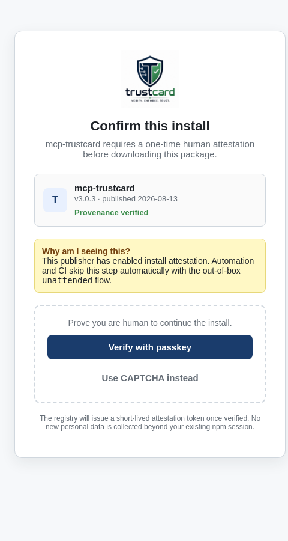

# Package-level install attestation for automated and human consumers

## Summary

This RFC proposes an **opt-in, registry-side** mechanism that lets package
publishers distinguish human-driven installs from automated installs at
download time. The registry's tarball endpoint acts as a per-package policy
proxy:

- **Automation, CI, agents, scrapers, and bots** receive an `unattended`
  attestation token **out of the box**, with no manual token setup, no browser,
  and no CAPTCHA. The request is logged and rate-limited, then the tarball is
  served immediately.
- **Human-driven installs** are directed through a one-time, strong
  proof-of-humanity step using WebAuthn / passkey, not a "brainless" CAPTCHA.
  The registry issues a `human` attestation token that is harder for headless
  automation to forge.

The design preserves the existing non-interactive install experience, does not
run any code on the consumer's machine, and only affects packages that
explicitly opt in.

## Motivation

1. **Download noise.** npm's public download counts are inflated by mirrors,
   scrapers, malware sandboxes, and misconfigured CI loops. Publishers cannot
   tell whether a spike represents real users, automated abuse, or
   infrastructure traffic.
2. **Manual scoped tokens are a burden.** Requiring every CI pipeline to create
   and rotate a per-package granular access token is operationally expensive and
   does not scale to one-off installs or public forks.
3. **CAPTCHAs are the wrong answer for software supply chains.** Image-based
   CAPTCHAs can be solved by computer-vision systems, create poor accessibility,
   and add friction without meaningful security. A real proof-of-humanity should
   rely on a hardware- or platform-backed credential.
4. **Trust-sensitive packages need a human loop.** Packages such as security
   tooling, MCP servers, or certificate/identity libraries may want to know that
   a human approved the first install, while still allowing every CI pipeline to
   pull exact versions non-interactively.
5. **A registry-side gate is the right place.** The registry already serves the
   tarball. Adding an optional, policy-driven check there is enforceable,
   transparent, and does not require changes to package contents or unrelated
   packages.

## Detailed Explanation

### 1. Package policy

A new optional package-level setting controls the gate. It can live in the
registry package document and be set from `package.json` at publish time:

```jsonc
{
  "publishConfig": {
    "attestation": "require"   // or "audit" or "none" (default)
  }
}
```

Allowed values:

- `"none"` (default): the existing install flow is unchanged.
- `"audit"`: the registry records an `install-attestation` event for every
  tarball fetch but does not block the install.
- `"require"`: the registry requires a valid attestation token before serving
  the tarball. Both `unattended` and `human` tokens are accepted, so CI and
  headless automation continue to work out of the box.
- `"require-human"`: the registry only accepts `human` attestation tokens.
  This blocks pure unattended automation and is intended for extreme-risk
  packages. CI must then use a publisher-approved `automation` token or OIDC
  trusted publishing.

### 2. Attestation token kinds

The registry issues two primary token kinds from the install path:

- **`unattended`** — anonymous, short-lived, no account, no browser. Obtained
  automatically by the npm CLI when it detects a non-interactive environment.
  This is the "out of the box" path for CI, agents, scrapers, and bots.
- **`human`** — obtained after a WebAuthn / passkey ceremony with user presence.
  Bound to an npm account session (or, for unauthenticated users, to a
  device-bound public key). This is the path for interactive installs.

Optional higher-trust kinds for publishers who need them:

- **`automation`** — a long-lived granular access token explicitly created for
  CI. Allows higher rate limits and is useful for `"require-human"` packages
  that still run in CI.
- **`service`** — a registry-registered token for mirrors and public indexers.
  Rate-limited separately and may be required to identify themselves.

### 3. Unattended attestation flow (out of the box)

When `npm install` runs in a non-interactive environment, the CLI automatically
requests an `unattended` token before fetching the tarball:

```text
Client GET /:pkg/-/:pkg-:version.tgz
       npm-attestation: unattended   (client advertises support)

Registry:
  if package.attestation in ("audit", "require"):
       issue short-lived unattended token
       emit install-attestation event with tokenKind "unattended"
       return tarball
```

No manual token, no browser, no CAPTCHA. The registry may apply a lightweight
rate limit and proof-of-work nonce to the token endpoint, but nothing that
blocks normal CI or one-off scripts.

The `unattended` token is cached locally by the CLI (for example in
`~/.npm/_attestations`) with a TTL and is reused for the same package scope
within the session.

### 4. Human attestation flow (interactive installs)

When `npm install` runs in an interactive terminal, the CLI requests a `human`
token:

```text
Client GET /:pkg/-/:pkg-:version.tgz
       npm-attestation: human

Registry:
  if package.attestation == "require" or "require-human":
       return 428 Precondition Required
              + { error: "HUMAN_ATTESTATION_REQUIRED",
                  attestation_url: "https://www.npmjs.com/attest/install?..." }

CLI (npm >= version that advertises attestation support):
  if terminal has a browser or a supported passkey bridge:
       open attestation_url
  else:
       print URL and wait for user

  User performs a WebAuthn / passkey ceremony with user presence
  (biometric, PIN, or hardware security key tap).

  Registry verifies the assertion, issues a short-lived human attestation
  token bound to the package scope, and returns it to the CLI.

  CLI retries tarball request with:
       Authorization: Attestation <token>
  Registry validates token and returns tarball.
```

WebAuthn / passkey is chosen because:

- It requires user presence, not just pattern recognition.
- It is backed by hardware or platform authenticators.
- It is phishing-resistant when tied to `npmjs.com` origin.
- It does not expose new PII beyond an existing npm account session.

For users without a passkey, the registry may fall back to a one-time link sent
to a verified email or an OAuth re-authorization, but never to an image-based
CAPTCHA as the primary mechanism.

### 5. Compatibility with old clients

The registry gates installs **only** when the client advertises support via an
`npm-attestation` request header or a new CLI user-agent version. Clients that
do not advertise support continue to receive the tarball unchanged. This keeps
the feature opt-in and prevents breaking existing tooling.

### 6. Rate limits and logging

- `unattended` tokens receive a baseline rate limit, suitable for CI but
  throttled enough to curb abuse.
- `human` tokens receive a higher rate limit because the user has proven
  possession of an authenticator.
- `automation` and `service` tokens receive publisher- or registrar-controlled
  rate limits.
- Each tarball fetch emits a standardized `install-attestation` event:

```json
{
  "package": "mcp-trustcard",
  "version": "3.0.3",
  "timestamp": "2026-08-18T00:00:00Z",
  "tokenKind": "unattended",
  "attestationIdHash": "sha256:...",
  "userAgent": "npm/12.0.0",
  "ipHash": "sha256:..."
}
```

No raw IP or token value is retained.

### 7. Privacy and security

- `unattended` tokens are anonymous and short-lived.
- `human` tokens are tied to an npm account session or a device-bound public key,
  not to a raw fingerprint.
- The attestation page reuses the existing npm account session where possible.
- The feature must not collect new PII beyond what npm already holds for
  accounts.
- WebAuthn / passkey is the default proof-of-humanity mechanism.

### 8. Abuse prevention

To prevent typosquatters or malicious packages from using `"require-human"` to
force ads or harvest behavior:

- `"require-human"` may only be enabled for packages with provenance or that
  have existed for a minimum period (e.g. 30 days).
- A publisher cannot switch from `"none"` to `"require"` or `"require-human"`
  without a version bump and a deprecation notice.
- Scoped packages and organizations may enable `"require"` immediately;
  `"require-human"` still requires maturity.

### 9. Publisher-facing controls

Publishers can see, in their dashboard and via `npm view`:

- The share of `unattended` vs `human` installs.
- Top `userAgent` / IP-hash clusters for `unattended` traffic.
- Rate-limit hits and blocked requests.

This gives publishers the signal they currently lack without forcing every user
through a manual workflow.

## Browser attestation page

When the CLI opens `attestation_url`, the user sees a lightweight, branded page
rather than a generic error. The page should:

- Display the package identity (name, version, publisher, provenance status).
- Show the publisher's or ecosystem trust mark prominently. For example, the
  `mcp-trustcard` attestation page uses the trustcard shield logo:

  

- Explain why the attestation is required and how automation can avoid it
  (`unattended` flow, optional `automation` tokens).
- Offer a WebAuthn / passkey verification button as the primary action.
- Issue a short-lived, opaque attestation token to the CLI on success.

A reference HTML/CSS mockup is included alongside this RFC:

- [`rfc-assets/attestation-ui-mockup.html`](rfc-assets/attestation-ui-mockup.html)
- [`rfc-assets/attestation-ui-mockup.png`](rfc-assets/attestation-ui-mockup.png)
- [`rfc-assets/trustcard-logo.png`](rfc-assets/trustcard-logo.png)

The mockup demonstrates a centered card layout with the trustcard logo as the
hero mark, a package metadata panel, a "Provenance verified" badge, and a
primary "Verify with passkey" button.



### Icons and imagery guidelines

- **Hero mark:** publisher or ecosystem trust logo (shield, lock, or verified
  badge). Avoid animated or ad-like imagery.
- **Status icons:** a small lock for provenance, a robot outline for unattended
  automation, and a user silhouette for human sessions.
- **Action icons:** fingerprint / security-key icon for WebAuthn, OAuth provider
  icons when available, and a generic puzzle-piece icon only for a
  CAPTCHA-based fallback.
- **Color palette:** neutral grays for the shell, a single brand accent color
  for primary actions, and amber for the informational notice.

## Rationale and Alternatives

1. **Do nothing / rely on global rate limits.** Global limits do not give
   publishers visibility into whether traffic is human or automated, and they
   cannot apply a per-package policy.
2. **Manual scoped tokens for every CI job.** Rejected: operationally expensive,
   excludes public forks, one-off scripts, and scrapers that are not malicious.
   It also does not help publishers understand real human usage.
3. **Image-based CAPTCHA at install time.** Rejected: poor accessibility, can
   be solved by computer-vision systems, and adds friction without meaningful
   security.
4. **Package `postinstall` challenge.** Rejected: lifecycle scripts can be
   disabled with `--ignore-scripts`, cannot reliably detect a terminal, and are
   a poor security boundary. They also cannot stop the tarball from being
   downloaded.
5. **Client-side wrapper (`npx <pkg>-install`).** Rejected: trivially bypassed
   and does not protect the registry or the publisher's metrics.
6. **Mandatory attestation for all public packages.** Rejected: would be
   catastrophically disruptive and harm npm adoption. The feature must be
   publisher-opt-in.

The chosen design is a registry-side, per-package gate with two speed lanes:
`unattended` for automation out of the box, and `human` via WebAuthn / passkey
for interactive installs. It gives publishers the signal they need while
preserving the friction-free CI experience.

## Implementation

### Registry

- Add `attestation` to the package document schema.
- Update the tarball endpoint to classify requests and emit
  `install-attestation` events.
- Implement `428 Precondition Required` for human attestation and an anonymous
  `unattended` token issuance endpoint.
- Add token-kind enforcement to granular access tokens.

### CLI

- Add `npm-attestation` header support to `npm install`.
- Detect interactive vs non-interactive environments.
- In non-interactive mode, automatically obtain an `unattended` token.
- In interactive mode, open the human attestation URL and handle the
  WebAuthn / passkey flow.
- Cache both token kinds locally.
- Add `npm token create --kind=automation|--kind=service` for publishers who
  need higher-trust tokens.

### Web

- Build the `/attest/install` endpoint.
- Integrate WebAuthn / passkey ceremony with existing npm account/auth.
- Provide fallback paths (email link, OAuth re-auth) only when passkey is
  unavailable.

### Documentation

- Update registry API documentation, access-token docs, and the acceptable-use
  policy to describe the new behavior and rate-limit classes.

## Prior Art

- **Docker Hub** unauthenticated pull limits and authenticated rate tiers.
- **PyPI** project file-size and bandwidth limits.
- **GitHub Packages** scoped tokens and OIDC trusted publishing.
- **npm provenance / Sigstore** (publish-time attestation): this RFC is
  complementary — provenance says *where* a package was built; install
  attestation says *who* requested the install.
- **Cloudflare Turnstile** and **hCaptcha** invisible challenges: distinguish
  humans from bots without interactive puzzles.
- **WebAuthn / FIDO2** user-presence ceremonies: a hardware-backed
  proof-of-humanity used by major identity providers.

## Unresolved Questions and Bikeshedding

1. Should `unattended` tokens require a small proof-of-work or proof-of-space
   challenge to raise the cost of large-scale abuse without breaking CI?
2. How should the CLI detect "interactive" accurately? `isatty(stdin)` is a
   start, but containers and pseudoterminals complicate it. Should an
   `NPM_ATTESTATION=human|unattended` environment variable override?
3. What is the default TTL for `unattended` vs `human` tokens? One hour is
   proposed for both, but human sessions may last a full workday.
4. Should `unattended` tokens be bound to a package scope, or should one token
   cover all installs in a session? Scope binding is safer; session binding is
   more convenient for CI with many dependencies.
5. Should old npm clients be served tarballs for `"require"` packages at all,
   or should they always get a `429` with a manual URL? Keeping them served
   avoids breaking legacy workflows but weakens the gate.
6. Should the gate apply to package metadata (`GET /:pkg`) or only to tarball
   fetches? Applying only to tarballs limits impact but may be bypassed by
   mirrors that already have the metadata.
7. What is the path for CI providers that cannot use unattended tokens, such as
   locked-down enterprise networks? A possible answer: allow `automation` tokens
   as a higher-trust opt-in with higher rate limits.
