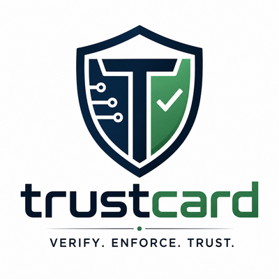
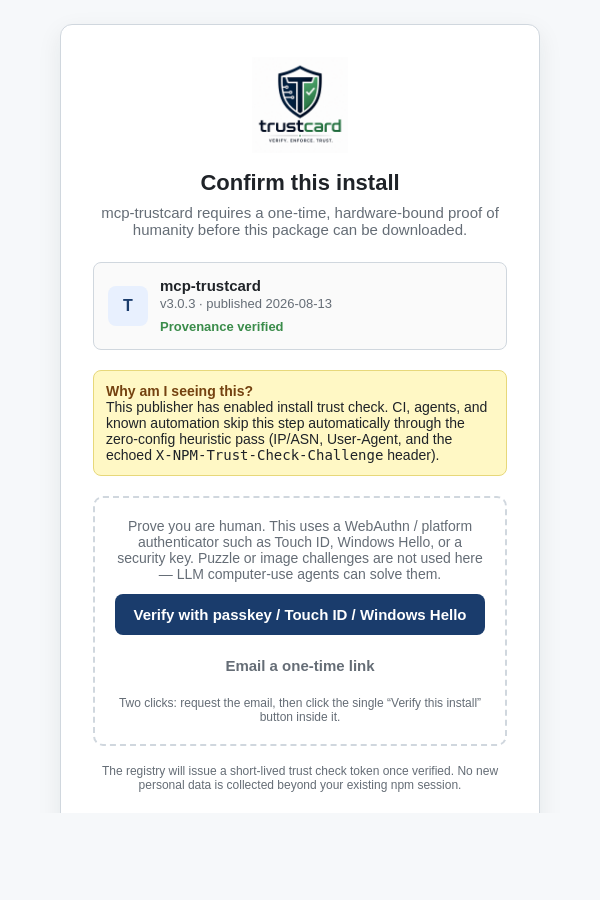

# Package-level install trust check for automated and human consumers

## Summary

This RFC proposes an **opt-in, registry-side** mechanism that lets package
publishers distinguish human-driven installs from automated installs at
download time. The registry's tarball endpoint acts as a per-package policy
proxy:

- **CI and legitimate automation** get a **zero-config heuristic automation
  pass**. The registry uses passive signals — IP/ASN, User-Agent/TLS
  fingerprint, and a honeypot header — to recognize automation and serve the
  tarball immediately. No tokens, no browser, no CAPTCHA, no manual setup.
- **Human-driven installs** are directed through a **hardware-bound
  proof-of-humanity** step using WebAuthn / platform biometric secure enclaves
  (Touch ID, Windows Hello, hardware security keys), not a visual CAPTCHA.
- **Known scrapers, abuse, and obvious non-human traffic** are classified as
  `spam_user` and **hard-blocked** with a 403/429 response. They are not offered
  a human challenge, an email fallback, or a CAPTCHA.
- **Visual/cognitive CAPTCHAs are explicitly deprecated** in this protocol
  because LLM computer-use agents can solve them.

The design preserves the existing non-interactive install experience, does not
run any code on the consumer's machine, and only affects packages that
explicitly opt in.

## Motivation

1. **Download noise.** npm's public download counts are inflated by mirrors,
   scrapers, malware sandboxes, and misconfigured CI loops. Publishers cannot
   tell whether a spike represents real users, automated abuse, or
   infrastructure traffic.
2. **Manual scoped tokens do not scale.** Requiring every CI pipeline to create
   and rotate a per-package token is operationally expensive, excludes public
   forks, and breaks one-off installs.
3. **CAPTCHAs are dead for supply-chain security.** Image-based and
   puzzle-based CAPTCHAs can be solved by modern computer-vision systems and
   LLM "Computer Use" agents. They are also inaccessible and create hostile UX.
   A real proof-of-humanity must rely on something an AI cannot access: the
   user's physical hardware and biometric secure enclave.
4. **Trust-sensitive packages need a human loop.** Packages such as security
   tooling, MCP servers, or identity libraries may want to know that a human
   approved the first install, while still allowing every CI pipeline to pull
   exact versions non-interactively.
5. **A registry-side gate is the right place.** The registry already serves the
   tarball. Adding an optional, policy-driven check there is enforceable,
   transparent, and does not require changes to package contents.

## Detailed Explanation

### 1. Package policy

A new optional package-level setting controls the gate. It can live in the
registry package document and be set from `package.json` at publish time:

```jsonc
{
  "publishConfig": {
    "trustCheck": "require"   // or "audit" or "none" (default)
  }
}
```

Allowed values:

- `"none"` (default): the existing install flow is unchanged.
- `"audit"`: the registry records an `install-trust-check` event for every
  tarball fetch but does not block the install.
- `"require"`: the registry requires a valid trust check token before serving
  the tarball. Both heuristic automation and hardware-bound human tokens are
  accepted, so CI and headless automation continue to work out of the box.
- `"require-human"`: the registry only accepts `human` trust check tokens.
  This blocks pure unattended automation and is intended for extreme-risk
  packages. CI must then use an approved `automation` token or OIDC trusted
  publishing.

### 2. Heuristic automation pass (zero-config)

When `npm install` runs in a CI or headless environment, the registry classifies
the request using passive telemetry. No client configuration is required.

Signals in the `CI signal catalog`:

- **IP/ASN reputation.** The registry maintains a list of autonomous systems
  known to host CI runners: GitHub Actions, AWS CodeBuild, GitLab CI, Azure
  Pipelines, Google Cloud Build, Vercel, Netlify, etc. Public IP range feeds
  keep the catalog current.
- **User-Agent and TLS fingerprinting.** Standard CI `User-Agent` strings and
  headless TLS fingerprints are recognized. A desktop browser fingerprint from
  a cloud IP is treated as ambiguous, not automatic.
- **Honeypot header.** The registry's metadata response includes a hidden
  `X-NPM-Trust-Check-Challenge` header with a nonce. The official npm CLI echoes
  the nonce (or a derived value) in the subsequent tarball request. Naive
  scrapers that skip the metadata fetch or do not mirror headers correctly are
  not recognized as legitimate automation and fall through to the human or
  blocked path.
- **Abuse signals.** Known bulk-scraper networks, TOR exit nodes, open proxies,
  exploit-tooling User-Agent strings, failed challenge patterns, and clients
  that exceed rate limits accumulate a negative `spam_score`. These requests do
  not get a challenge; they are denied immediately.

Classification flow:

```text
Client GET /:pkg/-/:pkg-:version.tgz
       (includes npm-trust-check header, UA, echoed challenge)

Registry:
  score = heuristic_automation_score(ip, asn, ua, tls_fp, challenge)
  spam_score = abuse_score(ip, asn, ua, tls_fp, rate_limit_violations, challenge)

  if spam_score >= SPAM_THRESHOLD:
       emit install-trust-check event with tokenKind "blocked"
       return 403 TRUST_CHECK_BLOCKED
  else if score >= AUTOMATION_THRESHOLD:
       emit install-trust-check event with tokenKind "heuristic-automation"
       return tarball + short-lived unattended trust check token
  else if score >= AMBIGUOUS_THRESHOLD:
       return tarball + short-lived "unattended" token with lower rate limit
  else:
       return 428 HUMAN_TRUST_CHECK_REQUIRED
```

The `heuristic-automation` and `unattended` tokens are anonymous, short-lived,
and cached by the CLI in `~/.npm/_trust-checks`. They require no account, no
browser, and no manual token.

A developer on a cloud VM who is falsely classified as automation can force the
human flow with:

```bash
NPM_TRUST_CHECK=human npm install <pkg>
```

### 3. Hardware-bound human trust check

When the registry sees a residential IP, an unknown scraper, a suspicious
headless browser, or any request that does not pass the automation heuristic, it
returns a `428 Precondition Required` with a `trust_check_url`.

The npm CLI intercepts the response and triggers a **native OS-level biometric
prompt** using WebAuthn / FIDO2 with `userVerification` required:

```text
Registry:
  return 428 Precondition Required
         + { error: "HUMAN_TRUST_CHECK_REQUIRED",
             trust_check_url: "https://www.npmjs.com/trust-check/install?nonce=..." }

CLI (npm >= version that advertises trust-check support):
  open OS native prompt:
       "Touch ID to install mcp-trustcard" (macOS)
       "Windows Hello to install mcp-trustcard" (Windows)
       "Use your security key to install mcp-trustcard" (cross-platform)

  User performs WebAuthn / passkey ceremony with user presence
  (fingerprint, face, PIN, or hardware security key tap).

  Authenticator signs the registry nonce with a hardware- or platform-backed
  private key scoped to npmjs.com and the package name.

  Registry verifies the signature, issues a short-lived human trust check
  token, and returns it to the CLI.

  CLI retries tarball request with:
       Authorization: Trust-Check <token>
  Registry validates token and returns tarball.
```

Why this beats LLM Computer Use:

- The private key lives in a secure enclave (TPM, Secure Enclave, YubiKey).
- User presence is required: a physical biometric or PIN entry.
- A remote LLM agent running in a cloud sandbox or via desktop automation does
  not have access to the developer's fingerprint sensor, Face ID, or hardware
  security key.
- The signature is cryptographically bound to the `npmjs.com` origin, so replay
  from a fake page is not possible.

### 4. Reputation fast pass

A logged-in npm CLI user with a high-reputation account can skip the biometric
prompt for `trustCheck: "require"` packages:

Qualifying signals (configurable by registry policy):

- Account age greater than a threshold (e.g. 6 months).
- 2FA enabled.
- Linked, aged GitHub account.
- No recent abuse reports or rate-limit violations.
- Prior successful hardware trust check on the same device.

When the account qualifies, the registry issues a `human` trust check token
without requiring a new biometric ceremony. This keeps daily development smooth
while ensuring fresh burner accounts and LLM agents cannot bypass the gate.

### 5. Optional higher-trust tokens

For CI environments that the heuristic catalog misses, or for publishers using
`"require-human"`, the CLI still supports explicit tokens:

- **`automation`** — long-lived granular access token for a specific CI
  pipeline.
- **`service`** — registry-registered token for mirrors and public indexers.

These are opt-in. The default path for CI is the zero-config heuristic pass.

### 6. Rate limits and logging

- `heuristic-automation` tokens receive a baseline CI rate limit.
- `unattended` (ambiguous) tokens receive a lower rate limit.
- `human` tokens receive a higher rate limit because the user has proven
  possession of an authenticator or passed reputation checks.
- `automation` and `service` tokens receive publisher- or registrar-controlled
  rate limits.
- `blocked` requests emit an `install-trust-check` event but no tarball is
  served. The response is 403 `TRUST_CHECK_BLOCKED`.
- Each tarball fetch or blocked attempt emits a standardized
  `install-trust-check` event:

```json
{
  "package": "mcp-trustcard",
  "version": "3.0.3",
  "timestamp": "2026-08-18T00:00:00Z",
  "tokenKind": "heuristic-automation",
  "trustCheckIdHash": "sha256:...",
  "automationSignals": ["asn:github-actions", "ua:ci", "challenge:echoed"],
  "userAgent": "npm/12.0.0",
  "ipHash": "sha256:..."
}
```

Blocked requests include a `tokenKind` of `blocked` and the set of abuse
signals that triggered the deny decision, without exposing the underlying raw
data.

No raw IP or token value is retained. Signal names are logged as categories,
not raw fingerprints.

### 7. Privacy and security

- The `heuristic-automation` pass uses only network and client metadata the
  registry already sees; no new tracking pixels or browser scripts are added.
- `unattended` and `heuristic-automation` tokens are anonymous and short-lived.
- `human` tokens are tied to an npm account session or a device-bound public
  key, not to a raw fingerprint.
- WebAuthn / passkey is the default proof-of-humanity mechanism.
- The `X-NPM-Trust-Check-Challenge` header is a nonce, not a cookie or tracker.

### 8. Abuse prevention

- `"require-human"` may only be enabled for packages with provenance or that
  have existed for a minimum period (e.g. 30 days).
- A publisher cannot switch from `"none"` to `"require"` or `"require-human"`
  without a version bump and a deprecation notice.
- Scoped packages and organizations may enable `"require"` immediately;
  `"require-human"` still requires maturity.
- The `heuristic-automation` catalog is versioned and auditable. False
  positives can be reported and corrected.
- `spam_user` classification is deliberately punitive: blocked clients are not
  offered a human challenge, email fallback, or CAPTCHA. They must stop the
  abusive behavior or use an approved `automation`/`service` token after
  publisher/admin review.

### 9. Publisher-facing controls

Publishers can see, in their dashboard and via `npm view`:

- The share of `heuristic-automation`, `unattended`, `human`, and `blocked`
  requests.
- Top signal categories for `heuristic-automation` traffic.
- Rate-limit hits and `blocked` request volume.

This gives publishers the signal they currently lack without forcing every user
through a manual workflow.

## Browser trust check page

When the CLI opens `trust_check_url` in a context where a native OS prompt is
not available (e.g. an older OS or a browser-based install flow), the user sees
a lightweight, branded page rather than a generic error. The page should:

- Display the package identity (name, version, publisher, provenance status).
- Show the publisher's or ecosystem trust mark prominently. For example, the
  `mcp-trustcard` trust check page uses the trustcard shield logo:

  

- Explain why the trust check is required and how automation is handled
  (zero-config heuristic pass; no tokens needed).
- Offer a **WebAuthn / passkey** verification button as the primary action.
- **Not** offer a visual or cognitive CAPTCHA. The only allowed fallbacks are
  hardware-bound trust check, a one-time email link to a verified address, or an
  OAuth re-authorization for logged-in users.
- If an email link fallback is used, keep it to **two clicks**: one click to
  request the link, and one click on the "Verify this install" button in the
  email. No copying codes, no switching apps to paste, no additional forms.
- Issue a short-lived, opaque trust check token to the CLI on success.

A reference HTML/CSS mockup is included alongside this RFC:

- [`rfc-assets/trust-check-ui-mockup.html`](rfc-assets/trust-check-ui-mockup.html)
- [`rfc-assets/trust-check-ui-mockup.png`](rfc-assets/trust-check-ui-mockup.png)
- [`rfc-assets/trustcard-logo.png`](rfc-assets/trustcard-logo.png)

The mockup demonstrates a centered card layout with the trustcard logo as the
hero mark, a package metadata panel, a "Provenance verified" badge, and a
primary "Verify with passkey" button. The secondary fallback is a one-time
email link, not a CAPTCHA.



### Icons and imagery guidelines

- **Hero mark:** publisher or ecosystem trust logo (shield, lock, or verified
  badge). Avoid animated or ad-like imagery.
- **Status icons:** a small lock for provenance, a robot outline for heuristic
  automation, and a user silhouette for human sessions.
- **Action icons:** fingerprint / security-key icon for WebAuthn, email icon
  for the one-time link fallback, OAuth provider icons when available.
- **Forbidden:** image-based CAPTCHA widgets, puzzle grids, "click all
  traffic lights" interfaces, or any visual challenge an LLM can solve.
- **Color palette:** neutral grays for the shell, a single brand accent color
  for primary actions, and amber for the informational notice.

## Dead CAPTCHA Rationale

Visual and cognitive CAPTCHAs are explicitly deprecated in this protocol. They
are no longer a meaningful barrier to automated or adversarial clients and are
harmful to legitimate users.

### Why CAPTCHAs are not acceptable here

1. **LLM Computer Use can solve them.** Modern agents can already interact with
   GUIs, read distorted text, click puzzle tiles, and solve "I am not a robot"
   challenges through the same input modalities as a human. A CAPTCHA that is
   solvable by a person is increasingly solvable by a model.
2. **Computer vision and image models bypass image challenges.** Grids of
   traffic lights, crosswalks, and buses can be parsed reliably by off-the-shelf
   vision models. There is no confidence that an image challenge distinguishes a
   human from an AI.
3. **Audio and text CAPTCHAs are similarly weak.** Speech-to-text and reading
   comprehension models defeat audio and logic-puzzle variants.
4. **Accessibility is poor.** CAPTCHAs create friction for screen-reader users,
   motor-impaired users, and users on low-bandwidth or constrained devices.
5. **They add latency without adding security.** A CAPTCHA round-trip slows down
   an install and gives publishers a false sense of protection.

### What replaces CAPTCHA

This protocol relies on **what an automated agent physically cannot access**:
the developer's local hardware and biometric secure enclave. WebAuthn / FIDO2
with user presence, platform authenticators (Touch ID, Windows Hello), and
hardware security keys require physical interaction with a device. A remote LLM
running in a cloud sandbox cannot touch a fingerprint sensor, a TPM, or a YubiKey.

Because of these facts, the browser trust check page and CLI flow **must not**
offer a CAPTCHA option. The only permitted fallbacks are hardware-bound
trust check, a one-time email link to a verified address, or OAuth
re-authorization for a logged-in, reputable account.

## Rationale and Alternatives

1. **Do nothing / rely on global rate limits.** Global limits do not give
   publishers visibility into whether traffic is human or automated, and they
   cannot apply a per-package policy.
2. **Manual scoped tokens for every CI job.** Rejected: operationally expensive,
   excludes public forks, one-off scripts, and scrapers that are not malicious.
   It also does not help publishers understand real human usage.
3. **Image-based or cognitive CAPTCHA at install time.** Rejected: poor
   accessibility, easily solved by LLM computer-use and computer-vision
   systems, and adds friction without meaningful security. This RFC explicitly
   deprecates CAPTCHA as a primary or fallback mechanism.
4. **Package `postinstall` challenge.** Rejected: lifecycle scripts can be
   disabled with `--ignore-scripts`, cannot reliably detect a terminal, and are
   a poor security boundary. They also cannot stop the tarball from being
   downloaded.
5. **Client-side wrapper (`npx <pkg>-install`).** Rejected: trivially bypassed
   and does not protect the registry or the publisher's metrics.
6. **Mandatory trust check for all public packages.** Rejected: would be
   catastrophically disruptive and harm npm adoption. The feature must be
   publisher-opt-in.

The chosen design is a registry-side, per-package gate with three lanes:
heuristic automation classification for zero-config CI, hardware-bound
biometric trust check for humans, and a hard `blocked` category for known
scrapers and abuse. It gives publishers the signal they need, preserves the
friction-free CI experience, removes CAPTCHA as a viable bypass, and stops
plain scrapers from consuming a human challenge.

## Implementation

### Registry

- Build and maintain the `CI signal catalog` (ASN, IP ranges, UA patterns,
  TLS fingerprints).
- Build and maintain an `abuse signal catalog` (known scraper ASNs, TOR exit
  nodes, open proxies, exploit tooling signatures, rate-limit violators).
- Add `X-NPM-Trust-Check-Challenge` to metadata responses and validate the
  echoed value on tarball requests.
- Add `trustCheck` to the package document schema.
- Update the tarball endpoint to classify requests and emit
  `install-trust-check` events.
- Implement `403 TRUST_CHECK_BLOCKED` for `spam_user` classification.
- Implement `428 Precondition Required` for human trust check and the anonymous
  `heuristic-automation` / `unattended` token issuance flow.
- Integrate WebAuthn verification into the trust check service.
- Add reputation fast-pass checks to account/session endpoints.

### CLI

- Add `npm-trust-check` header support and challenge-echo logic to `npm install`.
- Detect interactive vs non-interactive environments.
- In non-interactive or high-confidence CI environments, rely on the
  registry's heuristic response.
- In interactive environments or after `HUMAN_TRUST_CHECK_REQUIRED`, trigger the
  native OS WebAuthn / biometric prompt.
- Cache `heuristic-automation`, `unattended`, and `human` tokens locally.
- Add `NPM_TRUST_CHECK=human|unattended` override for false positives.
- Keep `npm token create --kind=automation|--kind=service` for publishers who
  need higher-trust explicit tokens.

### Web

- Build the `/trust-check/install` endpoint.
- Integrate WebAuthn / passkey ceremony with existing npm account/auth.
- Provide **only** hardware-bound or account-reputation fallback paths.
- If offering an email link fallback, send a one-button deep link so the total
  user interaction is two clicks (request + confirm).
- Explicitly do not implement image-based CAPTCHA.

### Documentation

- Update registry API documentation, access-token docs, and the acceptable-use
  policy to describe the new behavior, signal catalog, and rate-limit classes.
- Publish the "dead CAPTCHA" rationale for transparency.

## Prior Art

- **Docker Hub** unauthenticated pull limits and authenticated rate tiers.
- **PyPI** project file-size and bandwidth limits.
- **GitHub Packages** scoped tokens and OIDC trusted publishing.
- **npm provenance / Sigstore** (publish-time attestation): this RFC is
  complementary — provenance says *where* a package was built; install
  trust check says *who* requested the install.
- **Cloudflare Turnstile** and **hCaptcha** invisible challenges: distinguish
  humans from bots without interactive puzzles. This RFC goes further by
  removing visual challenges entirely.
- **WebAuthn / FIDO2** user-presence ceremonies: a hardware-backed
  proof-of-humanity used by major identity providers.
- **Device-bound credentials** in native apps (iOS Secure Enclave, Windows
  Hello, Android Keystore) for local biometric authentication.

## Unresolved Questions and Bikeshedding

1. How often should the `CI signal catalog` be updated, and who maintains the
   canonical list of cloud provider IP ranges?
2. Should `heuristic-automation` classification require the `X-NPM-Trust-Check-Challenge`
   echo, or should ASN/UA alone be enough for a fast pass?
3. What is the exact reputation score formula for the fast pass? Account age,
   2FA, GitHub linkage, prior trust check history, package ownership?
4. How should false positives be handled? A `NPM_TRUST_CHECK=human` environment
   override is proposed; should there also be a registry appeal process?
5. Should `unattended` and `heuristic-automation` tokens be bound to a package
   scope, or should one token cover all installs in a session? Scope binding is
   safer; session binding is more convenient for CI with many dependencies.
6. Should old npm clients be served tarballs for `"require"` packages at all,
   or should they always get a `429` with a manual URL? Keeping them served
   avoids breaking legacy workflows but weakens the gate.
7. Should the gate apply to package metadata (`GET /:pkg`) or only to tarball
   fetches? Applying only to tarballs limits impact but may be bypassed by
   mirrors that already have the metadata.
8. What is the path for CI providers on private networks or custom runners that
   the heuristic catalog misses? Explicit `automation` tokens remain available
   as an opt-in fallback.
